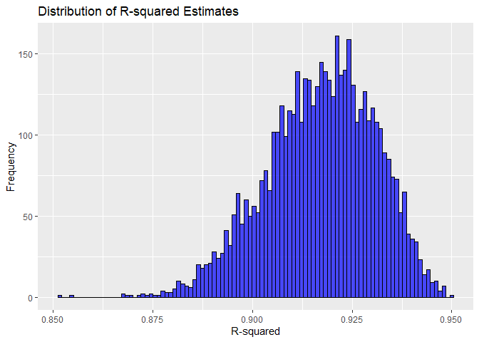
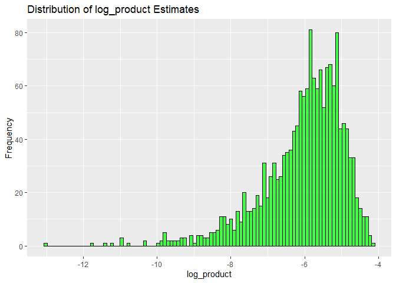
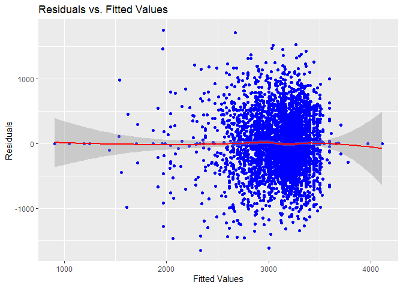
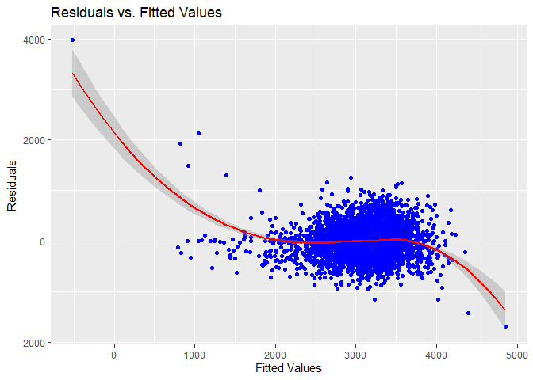
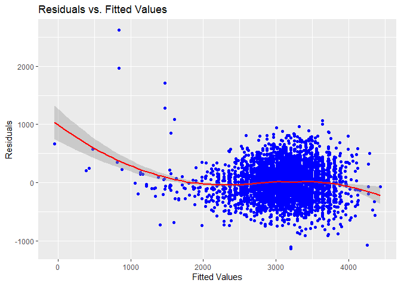
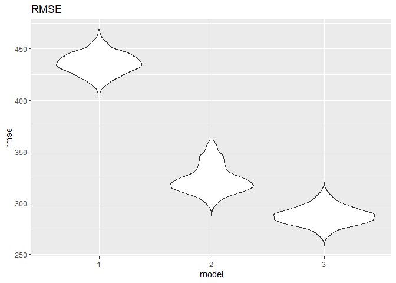

p8105_hw6_iho2104
================
Ixtaccihuatl Obregon
2023-12-02

``` r
library(tidyverse)
```

    ## ── Attaching core tidyverse packages ──────────────────────── tidyverse 2.0.0 ──
    ## ✔ dplyr     1.1.3     ✔ readr     2.1.4
    ## ✔ forcats   1.0.0     ✔ stringr   1.5.0
    ## ✔ ggplot2   3.4.3     ✔ tibble    3.2.1
    ## ✔ lubridate 1.9.2     ✔ tidyr     1.3.0
    ## ✔ purrr     1.0.2     
    ## ── Conflicts ────────────────────────────────────────── tidyverse_conflicts() ──
    ## ✖ dplyr::filter() masks stats::filter()
    ## ✖ dplyr::lag()    masks stats::lag()
    ## ℹ Use the conflicted package (<http://conflicted.r-lib.org/>) to force all conflicts to become errors

``` r
library(boot)
library(broom)
library(purrr)
library(ggplot2)
library(modelr)
```

    ## 
    ## Attaching package: 'modelr'
    ## 
    ## The following object is masked from 'package:broom':
    ## 
    ##     bootstrap

# Problem 1

``` r
homicide_df = 
  read_csv("homicide-data.csv", na = c("", "NA", "Unknown")) |> 
  mutate(
    city_state = str_c(city, state, sep = ", "),
    victim_age = as.numeric(victim_age),
    resolution = case_when(
      disposition == "Closed without arrest" ~ 0,
      disposition == "Open/No arrest"        ~ 0,
      disposition == "Closed by arrest"      ~ 1)
  ) |> 
  filter(victim_race %in% c("White", "Black")) |> 
  filter(!(city_state %in% c("Tulsa, AL", "Dallas, TX", "Phoenix, AZ", "Kansas City, MO"))) |> 
  select(city_state, resolution, victim_age, victim_sex, victim_race)
```

    ## Rows: 52179 Columns: 12
    ## ── Column specification ────────────────────────────────────────────────────────
    ## Delimiter: ","
    ## chr (8): uid, victim_last, victim_first, victim_race, victim_sex, city, stat...
    ## dbl (4): reported_date, victim_age, lat, lon
    ## 
    ## ℹ Use `spec()` to retrieve the full column specification for this data.
    ## ℹ Specify the column types or set `show_col_types = FALSE` to quiet this message.

logistic regression model using only data from Baltimore, MD.

``` r
baltimore_glm = 
  filter(homicide_df, city_state == "Baltimore, MD") |> 
  glm(resolution ~ victim_age + victim_sex + victim_race, family = binomial(), data = _)

baltimore_glm |> 
  broom::tidy() |> 
  mutate(
    OR = exp(estimate), 
    OR_CI_upper = exp(estimate + 1.96 * std.error),
    OR_CI_lower = exp(estimate - 1.96 * std.error)) |> 
  filter(term == "victim_sexMale") |> 
  select(OR, OR_CI_lower, OR_CI_upper) |>
  knitr::kable(digits = 3)
```

|    OR | OR_CI_lower | OR_CI_upper |
|------:|------------:|------------:|
| 0.426 |       0.325 |       0.558 |

``` r
model_results = 
  homicide_df |> 
  nest(data = -city_state) |> 
  mutate(
    models = map(data, \(df) glm(resolution ~ victim_age + victim_sex + victim_race, 
                             family = binomial(), data = df)),
    tidy_models = map(models, broom::tidy)) |> 
  select(-models, -data) |> 
  unnest(cols = tidy_models) |> 
  mutate(
    OR = exp(estimate), 
    OR_CI_upper = exp(estimate + 1.96 * std.error),
    OR_CI_lower = exp(estimate - 1.96 * std.error)) |> 
  filter(term == "victim_sexMale") |> 
  select(city_state, OR, OR_CI_lower, OR_CI_upper)

model_results |>
  slice(1:5) |> 
  knitr::kable(digits = 3)
```

| city_state      |    OR | OR_CI_lower | OR_CI_upper |
|:----------------|------:|------------:|------------:|
| Albuquerque, NM | 1.767 |       0.831 |       3.761 |
| Atlanta, GA     | 1.000 |       0.684 |       1.463 |
| Baltimore, MD   | 0.426 |       0.325 |       0.558 |
| Baton Rouge, LA | 0.381 |       0.209 |       0.695 |
| Birmingham, AL  | 0.870 |       0.574 |       1.318 |

``` r
model_results |> 
  mutate(city_state = fct_reorder(city_state, OR)) |> 
  ggplot(aes(x = city_state, y = OR)) + 
  geom_point() + 
  geom_errorbar(aes(ymin = OR_CI_lower, ymax = OR_CI_upper)) + 
  theme(axis.text.x = element_text(angle = 90, hjust = 1))
```

<!-- -->

A plot with estimated ORs and CIs for each city was generated. The plot
showed OR was less than 1 in most cities, meaning crimes with male
victims are less likely to be resolved compared to those with female
victims after accounting for victim age/race. New York showed the most
disparity. About half of the cities show a narrow CI that doesn’t
include 1, showing statistically significant deffience in resolution
rates between the sexes after adjustments.

# Problem 2

Load weather data

``` r
weather_df = 
  rnoaa::meteo_pull_monitors(
    c("USW00094728"),
    var = c("PRCP", "TMIN", "TMAX"), 
    date_min = "2022-01-01",
    date_max = "2022-12-31") |>
  mutate(
    name = recode(id, USW00094728 = "CentralPark_NY"),
    tmin = tmin / 10,
    tmax = tmax / 10) |>
  select(name, id, everything())
```

    ## using cached file: C:\Users\Ixtaccihuatl\AppData\Local/R/cache/R/rnoaa/noaa_ghcnd/USW00094728.dly

    ## date created (size, mb): 2023-10-03 10:17:34.939398 (8.542)

    ## file min/max dates: 1869-01-01 / 2023-09-30

Bootstrap and r_sq and log_product

``` r
set.seed(2023)

boot_straps = weather_df |> 
  modelr::bootstrap(n = 5000) |> 
  mutate(
    models = map(strap, ~lm(tmax ~ tmin + prcp, data = .)),
    results_1 = map(models, glance),
    results_2 = map(models, tidy)) |> 
  select(-strap, -models) |> 
  unnest() |>
  select(.id, r.squared, term, estimate) |> 
  filter(term !="(Intercept)") |> 
  pivot_wider(names_from = term, values_from = estimate) |> 
 mutate(
    tmin = as.numeric(tmin),
    prcp = as.numeric(prcp),
    log_product = log(tmin * prcp)
  )
```

    ## Warning: `cols` is now required when using `unnest()`.
    ## ℹ Please use `cols = c(results_1, results_2)`.

    ## Warning: There was 1 warning in `mutate()`.
    ## ℹ In argument: `log_product = log(tmin * prcp)`.
    ## Caused by warning in `log()`:
    ## ! NaNs produced

Distribution

``` r
ggplot(boot_straps, aes(x = r.squared)) +
  geom_histogram(bins = 100, fill = "blue", color = "black", alpha = 0.7) +
  labs(title = "Distribution of R-squared Estimates",
       x = "R-squared",
       y = "Frequency")
```

<!-- -->

``` r
ggplot(boot_straps, aes(x = log_product)) +
  geom_histogram(bins = 100, fill = "green", color = "black", alpha = 0.7) +
  labs(title = "Distribution of log_product Estimates",
       x = "log_product",
       y = "Frequency")
```

    ## Warning: Removed 3393 rows containing non-finite values (`stat_bin()`).

<!-- -->

Describe distribution plots: The distribution plot for r_squared
estimates showed a left-skewed distribution, showing most of the
bootstraps for r_square are concentrated around 0.925. The distribution
plot for log_product estimates showed a left-skewed distribution,
showing most of the bootstraps for log_product are concentrated around
-6.

CI Intervals

``` r
boot_straps |>
  select(r.squared, log_product) |> 
  pivot_longer(
    r.squared:log_product, 
    names_to = "variable", 
    values_to = "estimate"
  ) |> 
  group_by(variable) |> 
  summarize(
    lower_ci = quantile(estimate, 0.025, na.rm = TRUE), 
    upper_ci = quantile(estimate, 0.975, na.rm = TRUE), 
) |> 
  knitr::kable()
```

| variable    |   lower_ci |   upper_ci |
|:------------|-----------:|-----------:|
| log_product | -8.8645788 | -4.5383914 |
| r.squared   |  0.8885981 |  0.9403798 |

# Problem 3

Load and clean the data

``` r
birthweight_df = read.csv("birthweight.csv") 
str(birthweight_df)
```

    ## 'data.frame':    4342 obs. of  20 variables:
    ##  $ babysex : int  2 1 2 1 2 1 2 2 1 1 ...
    ##  $ bhead   : int  34 34 36 34 34 33 33 33 36 33 ...
    ##  $ blength : int  51 48 50 52 52 52 46 49 52 50 ...
    ##  $ bwt     : int  3629 3062 3345 3062 3374 3374 2523 2778 3515 3459 ...
    ##  $ delwt   : int  177 156 148 157 156 129 126 140 146 169 ...
    ##  $ fincome : int  35 65 85 55 5 55 96 5 85 75 ...
    ##  $ frace   : int  1 2 1 1 1 1 2 1 1 2 ...
    ##  $ gaweeks : num  39.9 25.9 39.9 40 41.6 ...
    ##  $ malform : int  0 0 0 0 0 0 0 0 0 0 ...
    ##  $ menarche: int  13 14 12 14 13 12 14 12 11 12 ...
    ##  $ mheight : int  63 65 64 64 66 66 72 62 61 64 ...
    ##  $ momage  : int  36 25 29 18 20 23 29 19 13 19 ...
    ##  $ mrace   : int  1 2 1 1 1 1 2 1 1 2 ...
    ##  $ parity  : int  3 0 0 0 0 0 0 0 0 0 ...
    ##  $ pnumlbw : int  0 0 0 0 0 0 0 0 0 0 ...
    ##  $ pnumsga : int  0 0 0 0 0 0 0 0 0 0 ...
    ##  $ ppbmi   : num  26.3 21.3 23.6 21.8 21 ...
    ##  $ ppwt    : int  148 128 137 127 130 115 105 119 105 145 ...
    ##  $ smoken  : num  0 0 1 10 1 0 0 0 0 4 ...
    ##  $ wtgain  : int  29 28 11 30 26 14 21 21 41 24 ...

``` r
summary(birthweight_df)
```

    ##     babysex          bhead          blength           bwt           delwt      
    ##  Min.   :1.000   Min.   :21.00   Min.   :20.00   Min.   : 595   Min.   : 86.0  
    ##  1st Qu.:1.000   1st Qu.:33.00   1st Qu.:48.00   1st Qu.:2807   1st Qu.:131.0  
    ##  Median :1.000   Median :34.00   Median :50.00   Median :3132   Median :143.0  
    ##  Mean   :1.486   Mean   :33.65   Mean   :49.75   Mean   :3114   Mean   :145.6  
    ##  3rd Qu.:2.000   3rd Qu.:35.00   3rd Qu.:51.00   3rd Qu.:3459   3rd Qu.:157.0  
    ##  Max.   :2.000   Max.   :41.00   Max.   :63.00   Max.   :4791   Max.   :334.0  
    ##     fincome          frace          gaweeks         malform        
    ##  Min.   : 0.00   Min.   :1.000   Min.   :17.70   Min.   :0.000000  
    ##  1st Qu.:25.00   1st Qu.:1.000   1st Qu.:38.30   1st Qu.:0.000000  
    ##  Median :35.00   Median :2.000   Median :39.90   Median :0.000000  
    ##  Mean   :44.11   Mean   :1.655   Mean   :39.43   Mean   :0.003455  
    ##  3rd Qu.:65.00   3rd Qu.:2.000   3rd Qu.:41.10   3rd Qu.:0.000000  
    ##  Max.   :96.00   Max.   :8.000   Max.   :51.30   Max.   :1.000000  
    ##     menarche        mheight          momage         mrace      
    ##  Min.   : 0.00   Min.   :48.00   Min.   :12.0   Min.   :1.000  
    ##  1st Qu.:12.00   1st Qu.:62.00   1st Qu.:18.0   1st Qu.:1.000  
    ##  Median :12.00   Median :63.00   Median :20.0   Median :2.000  
    ##  Mean   :12.51   Mean   :63.49   Mean   :20.3   Mean   :1.627  
    ##  3rd Qu.:13.00   3rd Qu.:65.00   3rd Qu.:22.0   3rd Qu.:2.000  
    ##  Max.   :19.00   Max.   :77.00   Max.   :44.0   Max.   :4.000  
    ##      parity            pnumlbw     pnumsga      ppbmi            ppwt      
    ##  Min.   :0.000000   Min.   :0   Min.   :0   Min.   :13.07   Min.   : 70.0  
    ##  1st Qu.:0.000000   1st Qu.:0   1st Qu.:0   1st Qu.:19.53   1st Qu.:110.0  
    ##  Median :0.000000   Median :0   Median :0   Median :21.03   Median :120.0  
    ##  Mean   :0.002303   Mean   :0   Mean   :0   Mean   :21.57   Mean   :123.5  
    ##  3rd Qu.:0.000000   3rd Qu.:0   3rd Qu.:0   3rd Qu.:22.91   3rd Qu.:134.0  
    ##  Max.   :6.000000   Max.   :0   Max.   :0   Max.   :46.10   Max.   :287.0  
    ##      smoken           wtgain      
    ##  Min.   : 0.000   Min.   :-46.00  
    ##  1st Qu.: 0.000   1st Qu.: 15.00  
    ##  Median : 0.000   Median : 22.00  
    ##  Mean   : 4.145   Mean   : 22.08  
    ##  3rd Qu.: 5.000   3rd Qu.: 28.00  
    ##  Max.   :60.000   Max.   : 89.00

``` r
birthweight_df_tidy = birthweight_df |> 
  janitor::clean_names() |> 
  mutate( 
    gaweeks = as.factor(gaweeks),
    ppbmi = as.factor(ppbmi), 
    smoken = as.factor(smoken)
    )
str(birthweight_df_tidy)
```

    ## 'data.frame':    4342 obs. of  20 variables:
    ##  $ babysex : int  2 1 2 1 2 1 2 2 1 1 ...
    ##  $ bhead   : int  34 34 36 34 34 33 33 33 36 33 ...
    ##  $ blength : int  51 48 50 52 52 52 46 49 52 50 ...
    ##  $ bwt     : int  3629 3062 3345 3062 3374 3374 2523 2778 3515 3459 ...
    ##  $ delwt   : int  177 156 148 157 156 129 126 140 146 169 ...
    ##  $ fincome : int  35 65 85 55 5 55 96 5 85 75 ...
    ##  $ frace   : int  1 2 1 1 1 1 2 1 1 2 ...
    ##  $ gaweeks : Factor w/ 175 levels "17.70000076",..: 109 15 109 110 121 115 112 92 112 115 ...
    ##  $ malform : int  0 0 0 0 0 0 0 0 0 0 ...
    ##  $ menarche: int  13 14 12 14 13 12 14 12 11 12 ...
    ##  $ mheight : int  63 65 64 64 66 66 72 62 61 64 ...
    ##  $ momage  : int  36 25 29 18 20 23 29 19 13 19 ...
    ##  $ mrace   : int  1 2 1 1 1 1 2 1 1 2 ...
    ##  $ parity  : int  3 0 0 0 0 0 0 0 0 0 ...
    ##  $ pnumlbw : int  0 0 0 0 0 0 0 0 0 0 ...
    ##  $ pnumsga : int  0 0 0 0 0 0 0 0 0 0 ...
    ##  $ ppbmi   : Factor w/ 798 levels "13.07137012",..: 611 343 480 374 320 147 5 370 234 552 ...
    ##  $ ppwt    : int  148 128 137 127 130 115 105 119 105 145 ...
    ##  $ smoken  : Factor w/ 33 levels "0","0.125","0.75",..: 1 1 4 13 4 1 1 1 1 7 ...
    ##  $ wtgain  : int  29 28 11 30 26 14 21 21 41 24 ...

``` r
missing_values = colSums(is.na(birthweight_df_tidy))
print(missing_values)
```

    ##  babysex    bhead  blength      bwt    delwt  fincome    frace  gaweeks 
    ##        0        0        0        0        0        0        0        0 
    ##  malform menarche  mheight   momage    mrace   parity  pnumlbw  pnumsga 
    ##        0        0        0        0        0        0        0        0 
    ##    ppbmi     ppwt   smoken   wtgain 
    ##        0        0        0        0

Regression model for birth weight

``` r
bwt_model_1 = lm(bwt ~ gaweeks + smoken, data = birthweight_df_tidy)
bwt_model_2 = lm(bwt ~ blength + gaweeks , data = birthweight_df_tidy)
bwt_model_3 = lm(bwt ~ bhead*blength*babysex , data = birthweight_df_tidy)

summary(bwt_model_1)
```

    ## 
    ## Call:
    ## lm(formula = bwt ~ gaweeks + smoken, data = birthweight_df_tidy)
    ## 
    ## Residuals:
    ##      Min       1Q   Median       3Q      Max 
    ## -1650.91  -278.41    -1.11   278.29  1748.33 
    ## 
    ## Coefficients:
    ##                      Estimate Std. Error t value Pr(>|t|)    
    ## (Intercept)         2.863e+03  4.463e+02   6.416 1.56e-10 ***
    ## gaweeks18.70000076  6.731e+01  6.323e+02   0.106 0.915230    
    ## gaweeks19          -8.821e-10  6.311e+02   0.000 1.000000    
    ## gaweeks19.60000038  3.050e+02  6.317e+02   0.483 0.629247    
    ## gaweeks20.10000038 -1.256e+03  5.469e+02  -2.296 0.021711 *  
    ## gaweeks20.29999924  4.300e+01  5.466e+02   0.079 0.937295    
    ## gaweeks20.39999962 -9.920e+02  6.311e+02  -1.572 0.116064    
    ## gaweeks22.10000038  2.270e+02  6.311e+02   0.360 0.719101    
    ## gaweeks23.89999962  3.400e+02  6.311e+02   0.539 0.590099    
    ## gaweeks24           2.663e+02  6.323e+02   0.421 0.673661    
    ## gaweeks24.10000038 -6.988e+00  6.317e+02  -0.011 0.991175    
    ## gaweeks25           3.464e+02  5.473e+02   0.633 0.526757    
    ## gaweeks25.39999962 -2.029e+01  6.317e+02  -0.032 0.974382    
    ## gaweeks25.70000076 -4.671e+02  5.160e+02  -0.905 0.365373    
    ## gaweeks25.89999962 -9.413e+00  5.156e+02  -0.018 0.985436    
    ## gaweeks26          -4.707e+02  6.323e+02  -0.744 0.456696    
    ## gaweeks26.10000038  2.984e+02  5.470e+02   0.545 0.585440    
    ## gaweeks26.39999962  7.607e+02  6.325e+02   1.203 0.229152    
    ## gaweeks26.60000038 -5.025e+01  6.327e+02  -0.079 0.936699    
    ## gaweeks26.70000076 -1.956e+03  6.311e+02  -3.099 0.001953 ** 
    ## gaweeks26.89999962 -1.410e+02  6.311e+02  -0.223 0.823222    
    ## gaweeks27          -8.026e+02  5.469e+02  -1.468 0.142314    
    ## gaweeks27.10000038 -1.814e+03  6.311e+02  -2.874 0.004070 ** 
    ## gaweeks27.39999962 -1.814e+03  6.311e+02  -2.874 0.004070 ** 
    ## gaweeks27.60000038  1.079e+01  6.324e+02   0.017 0.986389    
    ## gaweeks27.70000076 -1.672e+03  6.311e+02  -2.649 0.008096 ** 
    ## gaweeks27.89999962 -8.973e+02  5.153e+02  -1.741 0.081690 .  
    ## gaweeks28          -1.241e+03  5.469e+02  -2.270 0.023274 *  
    ## gaweeks28.10000038 -1.700e+02  5.153e+02  -0.330 0.741487    
    ## gaweeks28.29999924 -8.231e+02  4.891e+02  -1.683 0.092487 .  
    ## gaweeks28.39999962 -2.647e+02  4.821e+02  -0.549 0.582989    
    ## gaweeks28.60000038 -6.766e+02  5.467e+02  -1.238 0.215932    
    ## gaweeks28.70000076 -1.095e+03  6.339e+02  -1.727 0.084177 .  
    ## gaweeks28.89999962 -7.777e+02  5.157e+02  -1.508 0.131631    
    ## gaweeks29          -4.971e+02  5.155e+02  -0.964 0.334947    
    ## gaweeks29.10000038 -9.668e-10  6.311e+02   0.000 1.000000    
    ## gaweeks29.29999924 -1.148e+03  5.466e+02  -2.100 0.035752 *  
    ## gaweeks29.60000038 -1.616e+03  6.311e+02  -2.561 0.010485 *  
    ## gaweeks29.70000076 -1.592e+03  6.325e+02  -2.518 0.011852 *  
    ## gaweeks29.89999962 -2.754e+02  4.889e+02  -0.563 0.573213    
    ## gaweeks30          -6.446e+02  5.469e+02  -1.179 0.238609    
    ## gaweeks30.10000038 -2.365e+02  4.995e+02  -0.473 0.635885    
    ## gaweeks30.29999924 -4.513e+02  4.889e+02  -0.923 0.355990    
    ## gaweeks30.39999962 -1.486e+02  4.889e+02  -0.304 0.761180    
    ## gaweeks30.60000038 -5.157e+02  4.889e+02  -1.055 0.291637    
    ## gaweeks30.70000076  4.080e+02  5.467e+02   0.746 0.455552    
    ## gaweeks31           3.757e+02  5.157e+02   0.729 0.466292    
    ## gaweeks31.10000038 -1.416e+02  5.158e+02  -0.275 0.783615    
    ## gaweeks31.29999924  6.036e+01  4.991e+02   0.121 0.903759    
    ## gaweeks31.39999962 -2.054e+02  5.154e+02  -0.399 0.690211    
    ## gaweeks31.60000038 -1.327e+03  5.469e+02  -2.427 0.015287 *  
    ## gaweeks31.70000076 -7.440e+02  6.317e+02  -1.178 0.238981    
    ## gaweeks31.89999962 -2.467e+02  4.773e+02  -0.517 0.605245    
    ## gaweeks32          -4.849e+02  4.705e+02  -1.031 0.302780    
    ## gaweeks32.09999847 -1.154e+02  4.825e+02  -0.239 0.810941    
    ## gaweeks32.29999924 -4.574e+02  4.736e+02  -0.966 0.334191    
    ## gaweeks32.40000153 -7.122e+02  4.778e+02  -1.490 0.136177    
    ## gaweeks32.59999847 -6.056e+02  5.467e+02  -1.108 0.268036    
    ## gaweeks32.70000076 -8.268e+02  4.737e+02  -1.745 0.080978 .  
    ## gaweeks32.90000153 -1.314e+01  5.007e+02  -0.026 0.979056    
    ## gaweeks33          -2.333e+01  4.820e+02  -0.048 0.961394    
    ## gaweeks33.09999847  1.363e+02  4.774e+02   0.285 0.775336    
    ## gaweeks33.29999924 -3.173e+02  6.325e+02  -0.502 0.615898    
    ## gaweeks33.40000153 -1.406e+02  4.705e+02  -0.299 0.765120    
    ## gaweeks33.59999847 -1.357e+02  4.662e+02  -0.291 0.770910    
    ## gaweeks33.70000076 -1.978e+02  4.772e+02  -0.415 0.678507    
    ## gaweeks33.90000153 -2.056e+02  4.650e+02  -0.442 0.658352    
    ## gaweeks34          -3.916e+02  4.705e+02  -0.832 0.405215    
    ## gaweeks34.09999847 -2.491e+02  4.646e+02  -0.536 0.591949    
    ## gaweeks34.29999924  1.602e+02  4.610e+02   0.348 0.728156    
    ## gaweeks34.40000153 -5.036e+02  4.772e+02  -1.055 0.291385    
    ## gaweeks34.59999847 -1.038e+02  4.585e+02  -0.226 0.820920    
    ## gaweeks34.70000076 -1.674e+02  4.704e+02  -0.356 0.721895    
    ## gaweeks34.90000153 -1.707e+02  4.632e+02  -0.368 0.712583    
    ## gaweeks35          -2.063e+02  4.568e+02  -0.452 0.651645    
    ## gaweeks35.09999847  3.993e+01  4.560e+02   0.088 0.930221    
    ## gaweeks35.29999924 -1.521e+02  4.546e+02  -0.335 0.737879    
    ## gaweeks35.40000153 -8.175e+01  4.600e+02  -0.178 0.858970    
    ## gaweeks35.59999847  1.033e+01  4.575e+02   0.023 0.981984    
    ## gaweeks35.70000076 -6.803e+01  4.556e+02  -0.149 0.881294    
    ## gaweeks35.90000153  9.454e+01  4.540e+02   0.208 0.835038    
    ## gaweeks36          -1.042e+02  4.586e+02  -0.227 0.820286    
    ## gaweeks36.09999847 -3.945e+01  4.555e+02  -0.087 0.930984    
    ## gaweeks36.29999924 -1.406e+00  4.540e+02  -0.003 0.997529    
    ## gaweeks36.40000153  7.569e+01  4.556e+02   0.166 0.868060    
    ## gaweeks36.59999847  5.280e+01  4.539e+02   0.116 0.907413    
    ## gaweeks36.70000076 -1.062e+02  4.556e+02  -0.233 0.815755    
    ## gaweeks36.90000153  1.095e+02  4.523e+02   0.242 0.808711    
    ## gaweeks37           1.923e+01  4.518e+02   0.043 0.966057    
    ## gaweeks37.09999847  1.236e+02  4.522e+02   0.273 0.784586    
    ## gaweeks37.29999924  8.359e+01  4.509e+02   0.185 0.852943    
    ## gaweeks37.40000153  3.163e+01  4.526e+02   0.070 0.944299    
    ## gaweeks37.59999847  1.386e+02  4.504e+02   0.308 0.758336    
    ## gaweeks37.70000076  3.462e+01  4.526e+02   0.076 0.939028    
    ## gaweeks37.90000153  1.468e+02  4.507e+02   0.326 0.744728    
    ## gaweeks38           4.442e+01  4.512e+02   0.098 0.921596    
    ## gaweeks38.09999847  1.305e+02  4.497e+02   0.290 0.771767    
    ## gaweeks38.29999924  1.435e+02  4.499e+02   0.319 0.749763    
    ## gaweeks38.40000153  1.550e+02  4.503e+02   0.344 0.730748    
    ## gaweeks38.59999847  2.722e+02  4.503e+02   0.605 0.545538    
    ## gaweeks38.70000076  3.399e+02  4.486e+02   0.758 0.448737    
    ## gaweeks38.90000153  2.881e+02  4.487e+02   0.642 0.520850    
    ## gaweeks39           2.905e+02  4.488e+02   0.647 0.517428    
    ## gaweeks39.09999847  3.008e+02  4.486e+02   0.670 0.502581    
    ## gaweeks39.29999924  2.593e+02  4.482e+02   0.579 0.562856    
    ## gaweeks39.40000153  2.818e+02  4.480e+02   0.629 0.529416    
    ## gaweeks39.59999847  3.707e+02  4.483e+02   0.827 0.408326    
    ## gaweeks39.70000076  3.638e+02  4.483e+02   0.812 0.417085    
    ## gaweeks39.90000153  3.900e+02  4.481e+02   0.870 0.384078    
    ## gaweeks40           4.171e+02  4.479e+02   0.931 0.351780    
    ## gaweeks40.09999847  3.879e+02  4.478e+02   0.866 0.386444    
    ## gaweeks40.29999924  5.055e+02  4.481e+02   1.128 0.259368    
    ## gaweeks40.40000153  4.583e+02  4.479e+02   1.023 0.306319    
    ## gaweeks40.59999847  4.294e+02  4.482e+02   0.958 0.338057    
    ## gaweeks40.70000076  4.007e+02  4.480e+02   0.894 0.371241    
    ## gaweeks40.90000153  4.181e+02  4.483e+02   0.933 0.351088    
    ## gaweeks41           4.841e+02  4.484e+02   1.080 0.280303    
    ## gaweeks41.09999847  4.549e+02  4.486e+02   1.014 0.310656    
    ## gaweeks41.29999924  5.391e+02  4.487e+02   1.201 0.229626    
    ## gaweeks41.40000153  5.036e+02  4.485e+02   1.123 0.261542    
    ## gaweeks41.59999847  4.377e+02  4.485e+02   0.976 0.329234    
    ## gaweeks41.70000076  5.819e+02  4.490e+02   1.296 0.195113    
    ## gaweeks41.90000153  5.784e+02  4.504e+02   1.284 0.199184    
    ## gaweeks42           6.393e+02  4.505e+02   1.419 0.155919    
    ## gaweeks42.09999847  6.124e+02  4.507e+02   1.359 0.174292    
    ## gaweeks42.29999924  5.998e+02  4.517e+02   1.328 0.184285    
    ## gaweeks42.40000153  5.037e+02  4.519e+02   1.115 0.265021    
    ## gaweeks42.59999847  5.216e+02  4.518e+02   1.155 0.248324    
    ## gaweeks42.70000076  7.292e+02  4.545e+02   1.604 0.108749    
    ## gaweeks42.90000153  3.568e+02  4.539e+02   0.786 0.431911    
    ## gaweeks43           3.479e+02  4.564e+02   0.762 0.445914    
    ## gaweeks43.09999847  5.023e+02  4.559e+02   1.102 0.270618    
    ## gaweeks43.29999924  4.279e+02  4.580e+02   0.934 0.350223    
    ## gaweeks43.40000153  4.080e+02  4.556e+02   0.896 0.370531    
    ## gaweeks43.59999847  4.407e+02  4.586e+02   0.961 0.336709    
    ## gaweeks43.70000076  2.960e+02  4.579e+02   0.646 0.518093    
    ## gaweeks43.90000153  3.087e+02  4.663e+02   0.662 0.508083    
    ## gaweeks44           6.422e+02  4.593e+02   1.398 0.162162    
    ## gaweeks44.09999847  6.678e+02  4.735e+02   1.410 0.158577    
    ## gaweeks44.29999924  4.300e+02  4.892e+02   0.879 0.379468    
    ## gaweeks44.40000153  3.403e+02  4.601e+02   0.740 0.459547    
    ## gaweeks44.59999847  5.655e+02  4.736e+02   1.194 0.232567    
    ## gaweeks44.70000076  3.960e+02  4.610e+02   0.859 0.390393    
    ## gaweeks44.90000153  6.523e+02  5.153e+02   1.266 0.205607    
    ## gaweeks45           4.739e+02  4.735e+02   1.001 0.317014    
    ## gaweeks45.09999847  7.336e+02  4.890e+02   1.500 0.133641    
    ## gaweeks45.29999924  5.655e+02  4.774e+02   1.185 0.236261    
    ## gaweeks45.40000153  5.300e+02  4.736e+02   1.119 0.263098    
    ## gaweeks45.59999847  5.721e+02  4.894e+02   1.169 0.242468    
    ## gaweeks45.70000076  5.209e+02  4.772e+02   1.091 0.275141    
    ## gaweeks45.90000153  4.255e+02  4.822e+02   0.883 0.377527    
    ## gaweeks46          -2.691e+01  4.890e+02  -0.055 0.956124    
    ## gaweeks46.09999847  6.169e+02  4.990e+02   1.236 0.216444    
    ## gaweeks46.29999924  5.742e+02  5.160e+02   1.113 0.265851    
    ## gaweeks46.40000153  9.129e+02  4.892e+02   1.866 0.062093 .  
    ## gaweeks46.59999847  5.860e+02  5.153e+02   1.137 0.255517    
    ## gaweeks46.70000076  3.547e+02  4.824e+02   0.735 0.462173    
    ## gaweeks46.90000153 -8.790e+02  6.311e+02  -1.393 0.163758    
    ## gaweeks47           7.103e+02  5.156e+02   1.378 0.168390    
    ## gaweeks47.09999847  5.390e+02  6.311e+02   0.854 0.393125    
    ## gaweeks47.29999924  5.685e+02  5.182e+02   1.097 0.272681    
    ## gaweeks47.40000153  8.040e+02  6.339e+02   1.268 0.204784    
    ## gaweeks47.70000076  2.555e+02  5.466e+02   0.467 0.640186    
    ## gaweeks47.90000153  3.680e+02  5.478e+02   0.672 0.501768    
    ## gaweeks48.29999924  1.106e+03  6.311e+02   1.752 0.079766 .  
    ## gaweeks48.40000153  6.240e+02  6.311e+02   0.989 0.322849    
    ## gaweeks48.70000076  2.617e+02  6.327e+02   0.414 0.679112    
    ## gaweeks49           3.899e+02  5.469e+02   0.713 0.475943    
    ## gaweeks49.09999847  9.931e+02  7.744e+02   1.283 0.199733    
    ## gaweeks49.29999924  3.975e+02  5.466e+02   0.727 0.467094    
    ## gaweeks49.40000153  5.390e+02  6.311e+02   0.854 0.393125    
    ## gaweeks49.90000153  5.099e+01  5.157e+02   0.099 0.921238    
    ## gaweeks50.70000076  3.177e+02  6.327e+02   0.502 0.615543    
    ## gaweeks50.90000153  7.768e+02  6.324e+02   1.228 0.219370    
    ## gaweeks51.29999924  4.260e+02  6.311e+02   0.675 0.499711    
    ## smoken0.125        -6.499e+01  7.296e+01  -0.891 0.373086    
    ## smoken0.75         -8.828e+01  7.402e+01  -1.193 0.233026    
    ## smoken1            -7.079e+01  3.919e+01  -1.806 0.070983 .  
    ## smoken2            -9.579e+01  3.981e+01  -2.406 0.016158 *  
    ## smoken3            -6.731e+01  3.933e+01  -1.711 0.087090 .  
    ## smoken4            -1.477e+02  4.479e+01  -3.299 0.000980 ***
    ## smoken5            -7.968e+01  4.145e+01  -1.923 0.054604 .  
    ## smoken6            -6.697e+01  5.974e+01  -1.121 0.262321    
    ## smoken7            -9.138e+01  6.393e+01  -1.429 0.152974    
    ## smoken8            -2.261e+02  6.513e+01  -3.471 0.000524 ***
    ## smoken9            -1.708e+02  1.023e+02  -1.670 0.094985 .  
    ## smoken10           -1.207e+02  2.809e+01  -4.298 1.77e-05 ***
    ## smoken11           -8.845e+01  1.640e+02  -0.539 0.589661    
    ## smoken12            4.209e+01  1.211e+02   0.348 0.728104    
    ## smoken13           -8.678e+01  1.070e+02  -0.811 0.417343    
    ## smoken14           -5.665e+02  3.179e+02  -1.782 0.074813 .  
    ## smoken15           -1.181e+02  4.620e+01  -2.557 0.010588 *  
    ## smoken16           -2.871e+02  2.260e+02  -1.270 0.204034    
    ## smoken17            6.005e+01  1.524e+02   0.394 0.693537    
    ## smoken18           -2.323e+02  1.094e+02  -2.123 0.033797 *  
    ## smoken19           -2.801e+02  2.266e+02  -1.236 0.216670    
    ## smoken20           -1.630e+02  2.794e+01  -5.834 5.81e-09 ***
    ## smoken22           -1.922e+02  3.176e+02  -0.605 0.545046    
    ## smoken23           -3.828e+02  2.247e+02  -1.703 0.088559 .  
    ## smoken24            2.549e+02  4.487e+02   0.568 0.570109    
    ## smoken25            1.100e+01  1.253e+02   0.088 0.930083    
    ## smoken30           -2.462e+02  6.601e+01  -3.730 0.000194 ***
    ## smoken33            1.154e+02  4.540e+02   0.254 0.799345    
    ## smoken35            4.980e+02  4.579e+02   1.087 0.276881    
    ## smoken40           -1.476e+02  8.619e+01  -1.713 0.086814 .  
    ## smoken50           -2.279e+02  4.486e+02  -0.508 0.611476    
    ## smoken60           -8.678e+02  4.486e+02  -1.934 0.053126 .  
    ## ---
    ## Signif. codes:  0 '***' 0.001 '**' 0.01 '*' 0.05 '.' 0.1 ' ' 1
    ## 
    ## Residual standard error: 446.3 on 4135 degrees of freedom
    ## Multiple R-squared:  0.2768, Adjusted R-squared:  0.2408 
    ## F-statistic: 7.683 on 206 and 4135 DF,  p-value: < 2.2e-16

``` r
summary(bwt_model_2)
```

    ## 
    ## Call:
    ## lm(formula = bwt ~ blength + gaweeks, data = birthweight_df_tidy)
    ## 
    ## Residuals:
    ##     Min      1Q  Median      3Q     Max 
    ## -1680.6  -208.2    -8.3   197.7  3973.6 
    ## 
    ## Coefficients:
    ##                      Estimate Std. Error t value Pr(>|t|)    
    ## (Intercept)        -3.125e+03  3.448e+02  -9.063   <2e-16 ***
    ## blength             1.247e+02  2.083e+00  59.881   <2e-16 ***
    ## gaweeks18.70000076 -1.247e+02  4.666e+02  -0.267   0.7892    
    ## gaweeks19           1.195e-10  4.666e+02   0.000   1.0000    
    ## gaweeks19.60000038  1.726e+01  4.666e+02   0.037   0.9705    
    ## gaweeks20.10000038 -4.205e+01  4.046e+02  -0.104   0.9172    
    ## gaweeks20.29999924  1.054e+02  4.041e+02   0.261   0.7943    
    ## gaweeks20.39999962 -6.178e+02  4.667e+02  -1.324   0.1856    
    ## gaweeks22.10000038 -3.967e+02  4.667e+02  -0.850   0.3954    
    ## gaweeks23.89999962  2.153e+02  4.666e+02   0.461   0.6446    
    ## gaweeks24          -3.000e+02  4.667e+02  -0.643   0.5204    
    ## gaweeks24.10000038 -2.947e+02  4.666e+02  -0.632   0.5276    
    ## gaweeks25          -3.344e+02  4.042e+02  -0.827   0.4082    
    ## gaweeks25.39999962 -1.410e+02  4.666e+02  -0.302   0.7625    
    ## gaweeks25.70000076  5.314e+01  3.811e+02   0.139   0.8891    
    ## gaweeks25.89999962  5.333e+01  3.810e+02   0.140   0.8887    
    ## gaweeks26          -2.885e+02  4.666e+02  -0.618   0.5364    
    ## gaweeks26.10000038 -1.554e+02  4.041e+02  -0.384   0.7007    
    ## gaweeks26.39999962  3.068e+02  4.667e+02   0.657   0.5110    
    ## gaweeks26.60000038 -4.475e+02  4.666e+02  -0.959   0.3376    
    ## gaweeks26.70000076 -4.591e+02  4.673e+02  -0.982   0.3260    
    ## gaweeks26.89999962 -1.410e+02  4.666e+02  -0.302   0.7625    
    ## gaweeks27          -3.966e+01  4.043e+02  -0.098   0.9219    
    ## gaweeks27.10000038 -4.418e+02  4.672e+02  -0.946   0.3444    
    ## gaweeks27.39999962 -4.418e+02  4.672e+02  -0.946   0.3444    
    ## gaweeks27.60000038 -2.097e+02  4.666e+02  -0.449   0.6531    
    ## gaweeks27.70000076 -5.493e+02  4.670e+02  -1.176   0.2396    
    ## gaweeks27.89999962 -5.231e+02  3.810e+02  -1.373   0.1699    
    ## gaweeks28          -5.265e+02  4.043e+02  -1.302   0.1929    
    ## gaweeks28.10000038 -2.947e+02  3.810e+02  -0.774   0.4392    
    ## gaweeks28.29999924 -5.007e+02  3.615e+02  -1.385   0.1661    
    ## gaweeks28.39999962 -2.957e+02  3.564e+02  -0.830   0.4067    
    ## gaweeks28.60000038 -3.004e+02  4.042e+02  -0.743   0.4574    
    ## gaweeks28.70000076 -6.630e+02  4.667e+02  -1.421   0.1555    
    ## gaweeks28.89999962 -2.169e+02  3.811e+02  -0.569   0.5693    
    ## gaweeks29          -3.627e+02  3.810e+02  -0.952   0.3412    
    ## gaweeks29.10000038 -2.495e+02  4.666e+02  -0.535   0.5929    
    ## gaweeks29.29999924 -5.866e+02  4.042e+02  -1.451   0.1468    
    ## gaweeks29.60000038 -8.675e+02  4.668e+02  -1.859   0.0632 .  
    ## gaweeks29.70000076 -6.740e+02  4.669e+02  -1.444   0.1489    
    ## gaweeks29.89999962 -2.016e+01  3.615e+02  -0.056   0.9555    
    ## gaweeks30          -4.929e+02  4.041e+02  -1.220   0.2227    
    ## gaweeks30.10000038 -2.279e+02  3.689e+02  -0.618   0.5368    
    ## gaweeks30.29999924 -3.650e+02  3.614e+02  -1.010   0.3126    
    ## gaweeks30.39999962 -1.064e+02  3.614e+02  -0.294   0.7686    
    ## gaweeks30.60000038 -3.479e+02  3.615e+02  -0.962   0.3359    
    ## gaweeks30.70000076  1.394e+02  4.041e+02   0.345   0.7302    
    ## gaweeks31           3.026e+01  3.810e+02   0.079   0.9367    
    ## gaweeks31.10000038 -3.417e+02  3.810e+02  -0.897   0.3698    
    ## gaweeks31.29999924  1.302e-10  3.689e+02   0.000   1.0000    
    ## gaweeks31.39999962 -1.209e+02  3.810e+02  -0.317   0.7510    
    ## gaweeks31.60000038 -7.513e+02  4.042e+02  -1.858   0.0632 .  
    ## gaweeks31.70000076 -4.080e+02  4.667e+02  -0.874   0.3820    
    ## gaweeks31.89999962 -1.811e+02  3.527e+02  -0.514   0.6076    
    ## gaweeks32          -1.653e+02  3.478e+02  -0.475   0.6347    
    ## gaweeks32.09999847  7.966e+01  3.564e+02   0.223   0.8232    
    ## gaweeks32.29999924 -3.421e+02  3.500e+02  -0.977   0.3284    
    ## gaweeks32.40000153 -4.345e+02  3.528e+02  -1.232   0.2181    
    ## gaweeks32.59999847 -3.541e+02  4.041e+02  -0.876   0.3809    
    ## gaweeks32.70000076 -4.873e+02  3.500e+02  -1.392   0.1639    
    ## gaweeks32.90000153 -2.307e+02  3.689e+02  -0.625   0.5317    
    ## gaweeks33          -4.412e+01  3.564e+02  -0.124   0.9015    
    ## gaweeks33.09999847  2.382e+01  3.527e+02   0.068   0.9462    
    ## gaweeks33.29999924 -6.465e+02  4.666e+02  -1.385   0.1660    
    ## gaweeks33.40000153 -2.024e+02  3.478e+02  -0.582   0.5606    
    ## gaweeks33.59999847 -1.093e+02  3.446e+02  -0.317   0.7511    
    ## gaweeks33.70000076 -2.427e+02  3.527e+02  -0.688   0.4914    
    ## gaweeks33.90000153 -1.675e+02  3.434e+02  -0.488   0.6257    
    ## gaweeks34          -1.766e+02  3.478e+02  -0.508   0.6117    
    ## gaweeks34.09999847 -1.017e+02  3.434e+02  -0.296   0.7672    
    ## gaweeks34.29999924 -7.568e+01  3.408e+02  -0.222   0.8243    
    ## gaweeks34.40000153 -4.200e+02  3.527e+02  -1.191   0.2338    
    ## gaweeks34.59999847 -2.584e+02  3.390e+02  -0.762   0.4459    
    ## gaweeks34.70000076 -3.519e+02  3.478e+02  -1.012   0.3117    
    ## gaweeks34.90000153 -1.978e+02  3.424e+02  -0.578   0.5636    
    ## gaweeks35          -2.261e+02  3.377e+02  -0.670   0.5032    
    ## gaweeks35.09999847 -8.288e+01  3.371e+02  -0.246   0.8058    
    ## gaweeks35.29999924 -1.807e+02  3.360e+02  -0.538   0.5907    
    ## gaweeks35.40000153 -1.051e+02  3.401e+02  -0.309   0.7574    
    ## gaweeks35.59999847 -1.569e+02  3.381e+02  -0.464   0.6427    
    ## gaweeks35.70000076  5.779e-02  3.368e+02   0.000   0.9999    
    ## gaweeks35.90000153 -2.953e+01  3.356e+02  -0.088   0.9299    
    ## gaweeks36          -1.286e+02  3.390e+02  -0.379   0.7044    
    ## gaweeks36.09999847 -7.081e+01  3.368e+02  -0.210   0.8335    
    ## gaweeks36.29999924 -9.433e+01  3.354e+02  -0.281   0.7785    
    ## gaweeks36.40000153 -1.713e+01  3.368e+02  -0.051   0.9594    
    ## gaweeks36.59999847 -9.161e+01  3.356e+02  -0.273   0.7849    
    ## gaweeks36.70000076 -1.837e+02  3.368e+02  -0.545   0.5855    
    ## gaweeks36.90000153 -1.383e+02  3.344e+02  -0.414   0.6792    
    ## gaweeks37          -5.065e+01  3.340e+02  -0.152   0.8795    
    ## gaweeks37.09999847 -5.484e+00  3.343e+02  -0.016   0.9869    
    ## gaweeks37.29999924 -5.269e+01  3.334e+02  -0.158   0.8744    
    ## gaweeks37.40000153 -4.811e+01  3.346e+02  -0.144   0.8857    
    ## gaweeks37.59999847 -2.965e+01  3.330e+02  -0.089   0.9291    
    ## gaweeks37.70000076 -7.050e+01  3.346e+02  -0.211   0.8331    
    ## gaweeks37.90000153 -7.044e+01  3.332e+02  -0.211   0.8326    
    ## gaweeks38          -6.474e+01  3.336e+02  -0.194   0.8461    
    ## gaweeks38.09999847 -2.662e+01  3.324e+02  -0.080   0.9362    
    ## gaweeks38.29999924 -2.934e+01  3.326e+02  -0.088   0.9297    
    ## gaweeks38.40000153 -1.091e+02  3.330e+02  -0.328   0.7432    
    ## gaweeks38.59999847  8.732e+00  3.329e+02   0.026   0.9791    
    ## gaweeks38.70000076  1.153e+02  3.317e+02   0.348   0.7282    
    ## gaweeks38.90000153  1.182e+01  3.317e+02   0.036   0.9716    
    ## gaweeks39           3.777e+01  3.318e+02   0.114   0.9094    
    ## gaweeks39.09999847  3.469e+01  3.316e+02   0.105   0.9167    
    ## gaweeks39.29999924  1.548e+01  3.314e+02   0.047   0.9627    
    ## gaweeks39.40000153  3.617e+01  3.312e+02   0.109   0.9130    
    ## gaweeks39.59999847  6.051e+01  3.315e+02   0.183   0.8552    
    ## gaweeks39.70000076  3.503e+01  3.314e+02   0.106   0.9158    
    ## gaweeks39.90000153  6.982e+01  3.313e+02   0.211   0.8331    
    ## gaweeks40           7.159e+01  3.312e+02   0.216   0.8289    
    ## gaweeks40.09999847  4.372e+01  3.311e+02   0.132   0.8950    
    ## gaweeks40.29999924  1.444e+02  3.314e+02   0.436   0.6630    
    ## gaweeks40.40000153  7.838e+01  3.312e+02   0.237   0.8129    
    ## gaweeks40.59999847  3.948e+01  3.314e+02   0.119   0.9052    
    ## gaweeks40.70000076  6.489e+01  3.313e+02   0.196   0.8447    
    ## gaweeks40.90000153  9.095e+01  3.315e+02   0.274   0.7838    
    ## gaweeks41           8.681e+01  3.315e+02   0.262   0.7935    
    ## gaweeks41.09999847  1.106e+02  3.317e+02   0.333   0.7389    
    ## gaweeks41.29999924  1.622e+02  3.318e+02   0.489   0.6249    
    ## gaweeks41.40000153  1.540e+02  3.316e+02   0.464   0.6424    
    ## gaweeks41.59999847  7.927e+01  3.316e+02   0.239   0.8111    
    ## gaweeks41.70000076  1.658e+02  3.320e+02   0.499   0.6176    
    ## gaweeks41.90000153  1.215e+02  3.331e+02   0.365   0.7153    
    ## gaweeks42           2.172e+02  3.330e+02   0.652   0.5144    
    ## gaweeks42.09999847  1.461e+02  3.332e+02   0.438   0.6612    
    ## gaweeks42.29999924  1.488e+02  3.340e+02   0.445   0.6560    
    ## gaweeks42.40000153  1.728e+02  3.341e+02   0.517   0.6050    
    ## gaweeks42.59999847  1.068e+02  3.340e+02   0.320   0.7491    
    ## gaweeks42.70000076  2.669e+02  3.361e+02   0.794   0.4272    
    ## gaweeks42.90000153  5.855e+01  3.356e+02   0.174   0.8615    
    ## gaweeks43           1.454e+02  3.374e+02   0.431   0.6665    
    ## gaweeks43.09999847  2.110e+02  3.371e+02   0.626   0.5314    
    ## gaweeks43.29999924  2.987e+01  3.386e+02   0.088   0.9297    
    ## gaweeks43.40000153  5.863e+01  3.368e+02   0.174   0.8618    
    ## gaweeks43.59999847  1.093e+02  3.390e+02   0.322   0.7471    
    ## gaweeks43.70000076  1.107e+01  3.381e+02   0.033   0.9739    
    ## gaweeks43.90000153  1.050e+02  3.446e+02   0.305   0.7607    
    ## gaweeks44           1.431e+02  3.396e+02   0.421   0.6735    
    ## gaweeks44.09999847  3.114e+02  3.500e+02   0.890   0.3736    
    ## gaweeks44.29999924  8.896e+01  3.615e+02   0.246   0.8056    
    ## gaweeks44.40000153  9.173e+01  3.401e+02   0.270   0.7874    
    ## gaweeks44.59999847  1.598e+02  3.500e+02   0.457   0.6480    
    ## gaweeks44.70000076  1.799e+02  3.408e+02   0.528   0.5976    
    ## gaweeks44.90000153  7.019e+01  3.811e+02   0.184   0.8539    
    ## gaweeks45           1.178e+02  3.500e+02   0.337   0.7365    
    ## gaweeks45.09999847  2.462e+02  3.615e+02   0.681   0.4960    
    ## gaweeks45.29999924  1.777e+02  3.528e+02   0.504   0.6146    
    ## gaweeks45.40000153  7.332e+00  3.501e+02   0.021   0.9833    
    ## gaweeks45.59999847  2.555e+02  3.615e+02   0.707   0.4797    
    ## gaweeks45.70000076  1.341e+01  3.528e+02   0.038   0.9697    
    ## gaweeks45.90000153  6.164e+01  3.564e+02   0.173   0.8627    
    ## gaweeks46          -1.867e+02  3.614e+02  -0.517   0.6054    
    ## gaweeks46.09999847  2.341e+02  3.689e+02   0.635   0.5257    
    ## gaweeks46.29999924 -3.023e+01  3.811e+02  -0.079   0.9368    
    ## gaweeks46.40000153  2.598e+02  3.616e+02   0.718   0.4725    
    ## gaweeks46.59999847  2.118e+02  3.810e+02   0.556   0.5784    
    ## gaweeks46.70000076 -5.178e+01  3.564e+02  -0.145   0.8845    
    ## gaweeks46.90000153 -5.048e+02  4.667e+02  -1.082   0.2795    
    ## gaweeks47           1.666e+02  3.811e+02   0.437   0.6620    
    ## gaweeks47.09999847  2.895e+02  4.666e+02   0.620   0.5350    
    ## gaweeks47.29999924  2.895e+02  3.810e+02   0.760   0.4474    
    ## gaweeks47.40000153  4.875e+02  4.666e+02   1.045   0.2962    
    ## gaweeks47.70000076  1.931e+02  4.041e+02   0.478   0.6327    
    ## gaweeks47.90000153  1.221e+02  4.041e+02   0.302   0.7625    
    ## gaweeks48.29999924  1.106e+03  4.666e+02   2.370   0.0178 *  
    ## gaweeks48.40000153  1.250e+02  4.667e+02   0.268   0.7888    
    ## gaweeks48.70000076  1.140e+02  4.666e+02   0.244   0.8070    
    ## gaweeks49          -2.069e+02  4.042e+02  -0.512   0.6089    
    ## gaweeks49.09999847  7.490e+02  4.667e+02   1.605   0.1086    
    ## gaweeks49.29999924  2.104e+02  4.041e+02   0.521   0.6027    
    ## gaweeks49.40000153  1.648e+02  4.667e+02   0.353   0.7241    
    ## gaweeks49.90000153 -2.624e+02  3.810e+02  -0.689   0.4911    
    ## gaweeks50.70000076  4.526e+01  4.666e+02   0.097   0.9227    
    ## gaweeks50.90000153  1.820e+02  4.667e+02   0.390   0.6965    
    ## gaweeks51.29999924  5.177e+01  4.667e+02   0.111   0.9117    
    ## ---
    ## Signif. codes:  0 '***' 0.001 '**' 0.01 '*' 0.05 '.' 0.1 ' ' 1
    ## 
    ## Residual standard error: 329.9 on 4166 degrees of freedom
    ## Multiple R-squared:  0.6017, Adjusted R-squared:  0.585 
    ## F-statistic: 35.96 on 175 and 4166 DF,  p-value: < 2.2e-16

``` r
summary(bwt_model_3)
```

    ## 
    ## Call:
    ## lm(formula = bwt ~ bhead * blength * babysex, data = birthweight_df_tidy)
    ## 
    ## Residuals:
    ##      Min       1Q   Median       3Q      Max 
    ## -1132.99  -190.42   -10.33   178.63  2617.96 
    ## 
    ## Coefficients:
    ##                         Estimate Std. Error t value Pr(>|t|)    
    ## (Intercept)           -13551.685   2759.413  -4.911 9.39e-07 ***
    ## bhead                    380.189     83.395   4.559 5.28e-06 ***
    ## blength                  225.900     57.398   3.936 8.43e-05 ***
    ## babysex                 6374.868   1677.767   3.800 0.000147 ***
    ## bhead:blength             -4.432      1.715  -2.583 0.009815 ** 
    ## bhead:babysex           -198.393     51.092  -3.883 0.000105 ***
    ## blength:babysex         -123.773     35.119  -3.524 0.000429 ***
    ## bhead:blength:babysex      3.878      1.057   3.670 0.000245 ***
    ## ---
    ## Signif. codes:  0 '***' 0.001 '**' 0.01 '*' 0.05 '.' 0.1 ' ' 1
    ## 
    ## Residual standard error: 287.7 on 4334 degrees of freedom
    ## Multiple R-squared:  0.6849, Adjusted R-squared:  0.6844 
    ## F-statistic:  1346 on 7 and 4334 DF,  p-value: < 2.2e-16

``` r
birthweight_df_tidy |> 
  add_predictions(bwt_model_1) |> 
  add_residuals(bwt_model_1) |> 
  ggplot(aes(x = pred, y = resid)) +
  geom_point(color = "blue") +
  geom_smooth(method = "loess", color = "red") +
  labs(title = "Residuals vs. Fitted Values",
       x = "Fitted Values",
       y = "Residuals")
```

    ## `geom_smooth()` using formula = 'y ~ x'

<!-- -->

``` r
birthweight_df_tidy |> 
  add_predictions(bwt_model_2) |> 
  add_residuals(bwt_model_2) |> 
  ggplot(aes(x = pred, y = resid)) +
  geom_point(color = "blue") +
  geom_smooth(method = "loess", color = "red") +
  labs(title = "Residuals vs. Fitted Values",
       x = "Fitted Values",
       y = "Residuals")
```

    ## `geom_smooth()` using formula = 'y ~ x'

<!-- -->

``` r
birthweight_df_tidy |> 
  add_predictions(bwt_model_3) |> 
  add_residuals(bwt_model_3) |> 
ggplot(aes(x = pred, y = resid)) +
  geom_point(color = "blue") +
  geom_smooth(method = "loess", color = "red") +
  labs(title = "Residuals vs. Fitted Values",
       x = "Fitted Values",
       y = "Residuals")
```

    ## `geom_smooth()` using formula = 'y ~ x'

<!-- -->

The linear regression models (bwt_model_1, bwt_model_2, and bwt_model_3)
were constructed to predict the birthweight (bwt) based on gestational
age in weeks (gaweeks) and a binary indicator for smoking during
pregnancy (smoken) for bwt_model_1, length at birth (blength) and
gestational age in weeks (gaweeks) for bwt_model_2, and the interaction
between head circumference at birth (bhead), length at birth (blength),
and baby’s sex (babysex) for bwt_model_3. add_predictions() and
add_residuals() were used to get fitted values and residuals.

Comparing

``` r
cv_df = 
  crossv_mc(birthweight_df_tidy,1000) 

cv_df =
  cv_df |> 
  mutate(
    train = map(train, as_tibble),
    test = map(test, as_tibble))

cv_df =
  cv_df |>
  mutate(
    bwt_model_1a  = map(train, \(df) bwt_model_1),
    bwt_model_2a  = map(train, \(df) bwt_model_2),
    bwt_model_3a  = map(train, \(df) bwt_model_3)) |> 
  mutate(
    rmse_1 = map2_dbl(bwt_model_1a, test, \(mod, df) rmse(model = mod, data = df)),
    rmse_2 = map2_dbl(bwt_model_2a, test, \(mod, df) rmse(model = mod, data = df)),
    rmse_3 = map2_dbl(bwt_model_3a, test, \(mod, df) rmse(model = mod, data = df)))

cv_df |> 
  select(starts_with("rmse")) |> 
  pivot_longer(
    everything(),
    names_to = "model", 
    values_to = "rmse",
    names_prefix = "rmse_") |> 
  mutate(model = fct_inorder(model)) |> 
  ggplot(aes(x = model, y = rmse)) + geom_violin()+
  labs(title = "RMSE")
```

<!-- -->
